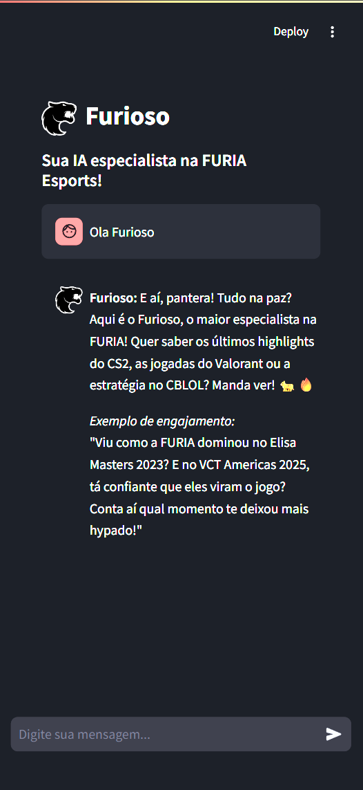
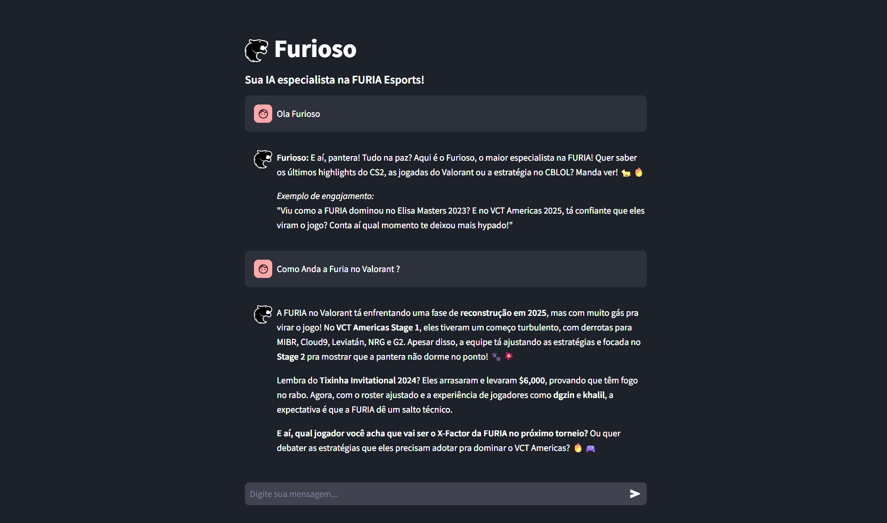

# 🔥 Furioso - Chatbot da FURIA Esports


## 🏆 Challenger FURIA #1

Protótipo de chatbot especializado em FURIA Esports, desenvolvido como parte do desafio Challenger FURIA #1. O Furioso utiliza modelos avançados de LLM para proporcionar uma comunicação fluida e natural sobre todos os aspectos da organização FURIA Esports.

### [🚀 Experimente o Furioso Agora!](https://app-streamlit.com)

## 📋 Sobre o Projeto

O Furioso é um assistente virtual especializado em tudo relacionado à FURIA Esports. Ele foi projetado para:

- Fornecer informações detalhadas sobre a FURIA nos jogos CS2, Valorant e CBLOL
- Manter conversas engajantes com foco nos feitos recentes (2023-2025)
- Utilizar um tom empolgado e autêntico, com gírias do cenário gamer
- Redirecionar sutilmente a conversa para o universo FURIA quando necessário

## 🛠️ Tecnologias Utilizadas

- **Streamlit**: Framework para criação da interface do chatbot
- **OpenAI API** (via 4everland): Motor de IA para processamento de linguagem natural
- **Python**: Linguagem de programação principal
- **DeepSeek LLM**: Modelo de linguagem para geração de respostas contextualizadas

## ✨ Funcionalidades

- **Interface de Chat Intuitiva**: Design limpo e responsivo para uma experiência de usuário agradável
- **Histórico de Conversas**: Armazena o histórico da conversa durante a sessão
- **Avatares Personalizados**: Identificação visual clara entre usuário e chatbot
- **Feedback Visual**: Indicadores de "digitando" enquanto processa respostas
- **Conhecimento Especializado**: Informações detalhadas sobre torneios, jogadores e conquistas da FURIA

## 🧠 Conhecimento do Furioso

O Furioso é especialista em:

### CS2 (antigo CS:GO)
- Vitória no Elisa Masters Espoo 2023 ($100,000)
- 5º-8º lugar no Esports World Cup 2024 ($40,000)
- 3º-4º no IEM Rio 2024 ($20,000)
- Participação no IEM Katowice 2025 (13º-16º, $10,000)

### Valorant
- Vitória no Tixinha Invitational 2024 ($6,000)
- Desempenho no VCT Americas Stage 1 e 2 de 2025

### League of Legends (CBLOL)
- Desempenho no CBLOL 2023-2024
- Participação na LTA South Split 1 2025 (5º-6º)
- Estratégias de reestruturação para 2025

## Resalva Principal
- Furioso Usa o Modelo DeepSeek-V3 Free que Não Possui Informações Mais Recentes Sobre a Furia em Seus Parametros.
- Solução Viavel Seria Integração Com Modelos $$$ Como GROK ou GPT-4 ou Superior Com Parametros Mais Atualizados.
- Pode Apresentar Diversas Incoerencias nos Dialogos Devido a Naturesa Defasada de Informações pois Todo Seu Conhecimento Recente foi "Inputado" Diretamente no Codigo e Não pre Treinado Com Eles.

## 🚀 Como Executar Localmente

1. Clone este repositório:
   ```bash
   git clone https://github.com/seu-usuario/ChallengeFURIA.git
   cd ChallengeFURIA
   ```

2. Instale as dependências:
   ```bash
   pip install -r requirements.txt
   ```

3. Configure suas chaves de API:
   - Crie um arquivo `.streamlit/secrets.toml` na Pasta do Usuario com sua chave API:
     ```toml
     [api_keys]
     API_KEY = "API_KEY"
     ```

4. Execute o aplicativo:
   ```bash
   streamlit run Furioso.py
   ```

## 📸 Screenshots


*Interface principal do chatbot Furioso*


*Exemplo de Pergunta Sobre o Valorant*

## 🔮 Próximos Passos

- Integração com API de Modelos de Ultima Geração para Dados da FURIA em tempo real
- Versão mobile dedicada
- Expansão do conhecimento para incluir estatísticas detalhadas de jogadores

## 👨‍💻 Autor

Desenvolvido por [Thiago Militão](https://github.com/residenthiago2011) para o Challenger FURIA #1.

## 📄 Licença

Este projeto está licenciado sob a [MIT License](LICENSE).

---

<p align="center">
  
  <br>
</p>